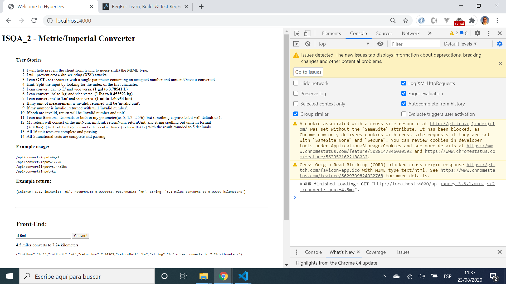

# :zap: Nodejs Metric-Imperial Converter (Information Security and Quality Assurance)

* Node.js app to convert numbers fom one unit to another
* Part of a FreeCodeCamp exercise for Front End Certification

*** Note: to open web links in a new window use: _ctrl+click on link_**

## :page_facing_up: Table of contents

* [:zap: Nodejs Metric-Imperial Converter (Information Security and Quality Assurance)](#zap-nodejs-metric-imperial-converter-information-security-and-quality-assurance)
	* [:page_facing_up: Table of contents](#page_facing_up-table-of-contents)
	* [:books: General info](#books-general-info)
	* [:camera: Screenshots](#camera-screenshots)
	* [:signal_strength: Technologies](#signal_strength-technologies)
	* [:floppy_disk: Setup](#floppy_disk-setup)
	* [:computer: Code Examples](#computer-code-examples)
	* [:cool: Features](#cool-features)
	* [:clipboard: Status & To-Do List](#clipboard-status--to-do-list)
	* [:clap: Inspiration](#clap-inspiration)
	* [:envelope: Contact](#envelope-contact)

## :books: General info

* This project is no longer part of the Free Code Camp Front End Certification. Original instructions from FCC:

1) SET NODE_ENV to `test` without quotes
2) You need to create all routes within `routes/api.js`
3) You will add any security features to `server.js`
4) You will create all of the functional tests in `tests/2_functional-tests.js`

## :camera: Screenshots

.

## :signal_strength: Technologies

* [Node v12](https://nodejs.org/en/) javaScript runtime built on Chrome's V8 JavaScript engine
* [Express v4](https://expressjs.com/) Fast, unopinionated, minimalist web framework for Node.js
* [mongoose v5](https://mongoosejs.com/) object modelling for node.js.
* [Helmet v4](https://helmetjs.github.io/) Express.js security with HTTP headers.
* [Cors v2](https://www.npmjs.com/package/cors) node.js package for providing Connect/Express middleware that can be used to enable CORS with various options.
* [jQuery v3](https://jquery.com/) Javascript library
* [Regex expressions website](https://regexr.com/)

## :floppy_disk: Setup

* Run `node server.js` for a dev server. Navigate to `http://localhost:4000/`.
* The app will not automatically reload if you change any of the source files.

## :computer: Code Examples

* extract from `convertHandler.js` to convert input value to different measurement type, eg gal to L. This could be done in fewer lines I am sure.

```javascript
	this.convert = function (initNum, initUnit) {
		const galToL = 3.78541;
		const lbsToKg = 0.453592;
		const miToKm = 1.60934;
		var result;
		switch (initUnit.toLowerCase()) {
			case 'lbs':
				result = initNum * lbsToKg;
				break;
			case 'kg':
				result = initNum / lbsToKg;
				break;
			case 'mi':
				result = initNum * miToKm;
				break;
			case 'km':
				result = initNum / miToKm;
				break;
			case 'gal':
				result = initNum * galToL;
				break;
			case 'l':
				result = initNum / galToL;
				break;
		}
		return result;
	}; //end of this.convert function
```

## :cool: Features

* Code better organised with Views, Routes (just `get` in this project) and Handlers in separate files

## :clipboard: Status & To-Do List

* Status: Working
* To-Do: replace var with const/let, use destructuring etc. This was early code just to pass the tests.

## :clap: Inspiration

* [freeCodeCamp's curriculum](https://www.freecodecamp.org/learn/) - although it has changed in the years since I completed this challlenge.

## :envelope: Contact

* Repo created by [ABateman](https://www.andrewbateman.org) - you are welcome to [send me a message](https://andrewbateman.org/contact)
